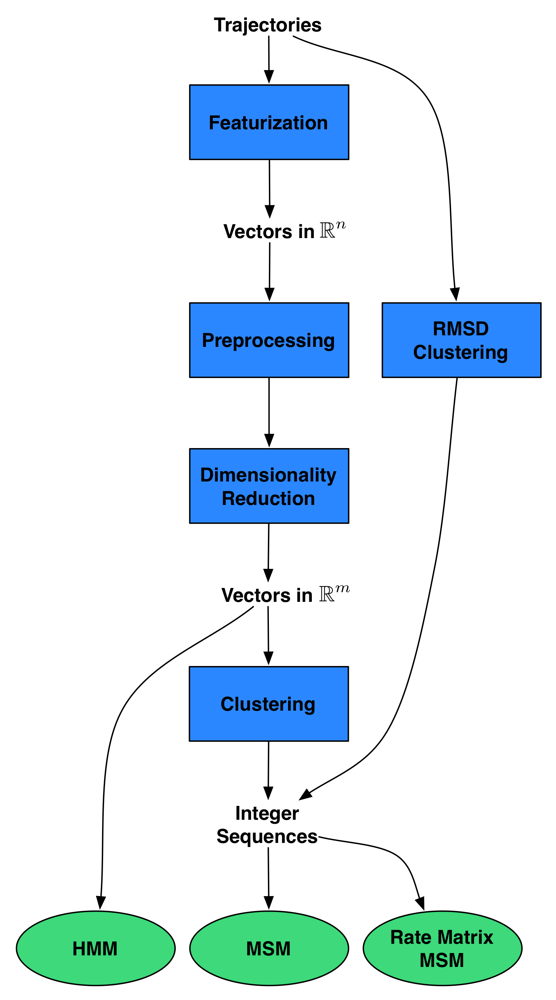
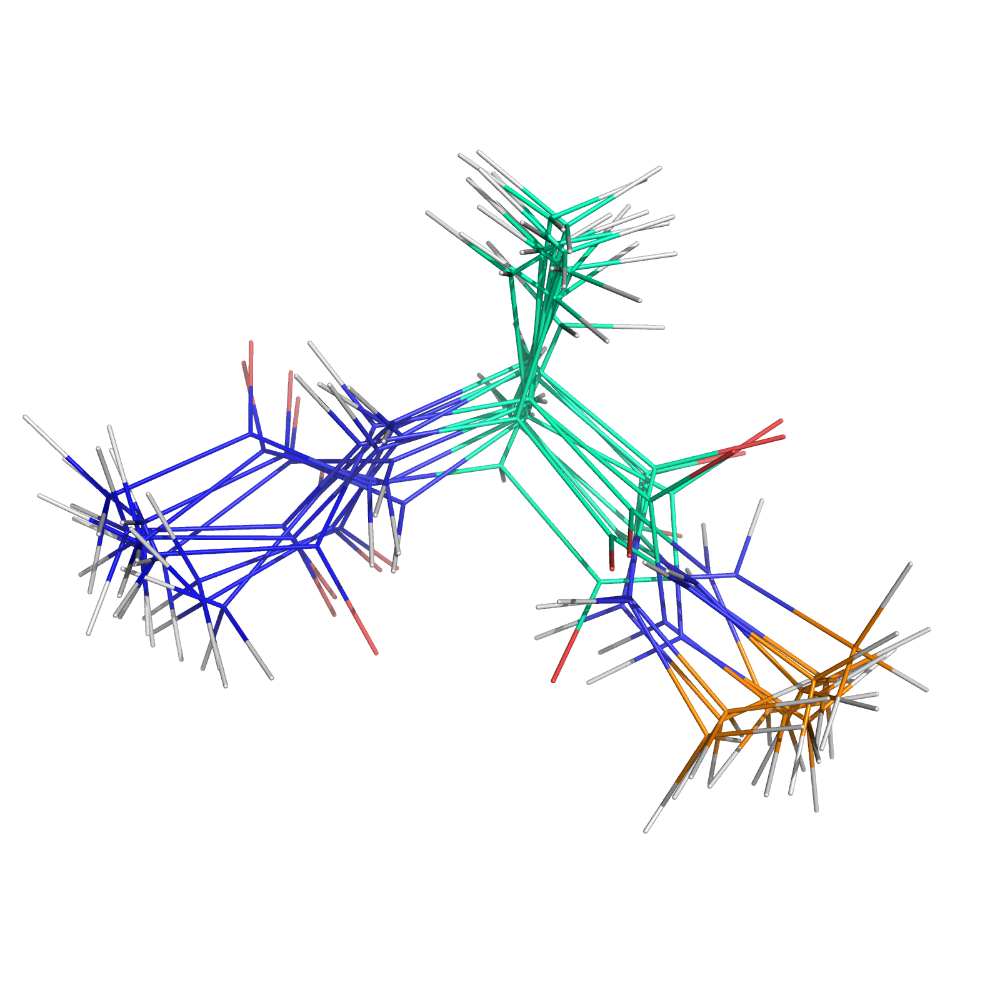

% title: Conformational Dynamics in MSMBuilder3
% author: Kyle A. Beauchamp
% author: Updated Feb. 27, 2015 (msmbuilder v3.1)

---
title: Old-School Analysis of MD Data

- Analysis happens in walled gardens (Gromacs, Amber, VMD)
- Exclusively command line interfaces, C and Fortran code
- Duplication of statistical algorithms by non-experts (e.g. chemists)
- Possible code maintainability issues?

---
title: Jarvis Patrick Clustering in Gromacs
subtitle: <a href="https://github.com/gromacs/gromacs/blob/master/src/gromacs/gmxana/gmx_cluster.c">real code in gromacs</a>

<pre class="prettyprint" data-lang="c">

static void jarvis_patrick(int n1, real **mat, int M, int P,
real rmsdcut, t_clusters *clust) {
t_dist *row;
t_clustid *c;
int **nnb;
int i, j, k, cid, diff, max;
gmx_bool bChange;
real **mcpy = NULL;
if (rmsdcut < 0) {
rmsdcut = 10000;
}
/* First we sort the entries in the RMSD matrix row by row.
* This gives us the nearest neighbor list.
*/
</pre>

---
title: Jarvis Patrick Clustering in Gromacs (Cont.)

<pre class="prettyprint" data-lang="c">

// Five more pages of this
// You get the idea

// Also, how do we even use this function?
static void jarvis_patrick(int n1, real **mat, int M, int P,
real rmsdcut, t_clusters *clust);
</pre>

---
title: Enter Data Science

- Machine learning is mainstream now!
- Thousands of experts are using machine learning approaches
- Well-tested, performant, and facile implementations are available
- Writing your own is not the way to go!
    * E.g: is clustering _that_ special and MD-specific such that
    we need our own custom algorithms and implementations? No. 

---
title: MSMBuilder3: Design

Builds on [scikit-learn](http://scikit-learn.org/stable/) idioms:

- Everything is a `Model`.
- Models are `fit()` on data.
- Models learn `attributes_`.
- `Pipeline()` concatenate models.
- Use best-practices (cross-validation)

<footer class="source"> 
http://rmcgibbo.org/posts/whats-new-in-msmbuilder3/
</footer>

---
title: Everything is a <code>Model()</code>!

<pre class="prettyprint" data-lang="python">

>>> import msmbuilder.cluster
>>> clusterer = msmbuilder.cluster.KMeans(n_clusters=4)

>>> import msmbuilder.decomposition
>>> tica = msmbuilder.decomposition.tICA(n_components=3)

>>> import msmbuilder.msm
>>> msm = msmbuilder.msm.MarkovStateModel()

</pre>

Hyperparameters go in the constructor.

<footer class="source"> 
Actually, everything is a <code>sklearn.base.BaseEstimator()</code>
</footer>

---
title: Models <code>fit()</code> data!

<pre class="prettyprint" data-lang="python">

>>> import msmbuilder.cluster

>>> trajectories = [np.random.normal(size=(100, 3))]

>>> clusterer = msmbuilder.cluster.KMeans(n_clusters=4, n_init=10)
>>> clusterer.fit(trajectories)

>>> clusterer.cluster_centers_

array([[-0.22340896,  1.0745301 , -0.40222902],
       [-0.25410827, -0.11611431,  0.95394687],
       [ 1.34302485,  0.14004818,  0.01130485],
       [-0.59773874, -0.82508303, -0.95703567]])

</pre>

Estimated parameters *always* have trailing underscores!

---
title: <code>fit()</code> acts on lists of sequences

<pre class="prettyprint" data-lang="python">

>>> import msmbuilder.msm

>>> trajectories = [np.array([0, 0, 0, 1, 1, 1, 0, 0])]

>>> msm = msmbuilder.msm.MarkovStateModel()
>>> msm.fit(trajectories)

>>> msm.transmat_

array([[ 0.75      ,  0.25      ],
       [ 0.33333333,  0.66666667]])

</pre>

This is different from sklearn, which uses 2D arrays.

---
title: Models <code>transform()</code> data!

<pre class="prettyprint" data-lang="python">

>>> import msmbuilder.cluster

>>> trajectories = [np.random.normal(size=(100, 3))]

>>> clusterer = msmbuilder.cluster.KMeans(n_clusters=4, n_init=10)
>>> clusterer.fit(trajectories)
>>> Y = clusterer.transform(trajectories)

[array([5, 6, 6, 0, 5, 5, 1, 6, 1, 7, 5, 7, 4, 2, 2, 2, 5, 3, 0, 0, 1, 3, 0,
        5, 5, 0, 4, 0, 0, 3, 4, 7, 3, 5, 5, 5, 6, 1, 1, 0, 0, 7, 4, 4, 2, 6,
        1, 4, 2, 0, 2, 4, 4, 5, 2, 6, 3, 2, 0, 6, 3, 0, 7, 7, 7, 0, 0, 0, 3,
        3, 2, 7, 6, 7, 2, 5, 1, 0, 3, 6, 3, 2, 0, 5, 0, 3, 4, 2, 5, 4, 1, 5,
        5, 4, 3, 3, 7, 2, 1, 4], dtype=int32)]

</pre>
Moving the data-items from one "space" / representation into another.

---
title: <code>Pipeline()</code> concatenates models!

<pre class="prettyprint" data-lang="python">

>>> import msmbuilder.cluster, msmbuilder.msm
>>> from sklearn.pipeline import Pipeline

>>> trajectories = [np.random.normal(size=(100, 3))]

>>> clusterer = msmbuilder.cluster.KMeans(n_clusters=2, n_init=10)
>>> msm = msmbuilder.msm.MarkovStateModel()
>>> pipeline = Pipeline([("clusterer", clusterer), ("msm", msm)])

>>> pipeline.fit(trajectories)
>>> msm.transmat_

array([[ 0.53703704,  0.46296296],
       [ 0.53333333,  0.46666667]])

</pre>
Data "flows" through transformations in the pipeline.

---
title: Featurizing Trajectories

Featurizers wrap MDTraj functions via the `transform()` function

<pre class="prettyprint" style="width:75%" data-lang="python">

>>> from msmbuilder.featurizer import DihedralFeaturizer
>>> from msmbuilder.example_datasets import fetch_alanine_dipeptide
>>> from matplotlib.pyplot import hexbin, plot

>>> trajectories = fetch_alanine_dipeptide()["trajectories"]
>>> featurizer = DihedralFeaturizer(
...        ["phi", "psi"], sincos=False)
>>> X = featurizer.transform(trajectories)
>>> phi, psi = np.rad2deg(np.concatenate(X).T)

>>> hexbin(phi, psi)
</pre>

---
title: Loading Trajectories

<pre class="prettyprint" data-lang="python">

>>> import glob
>>> import mdtraj as md

>>> filenames = glob.glob("./Trajectories/*.h5")
>>> trajectories = [md.load(filename) for filename in filenames]

</pre>

Note: for big datasets, you can get fancy with ``md.iterload``.

---
title: Old-school MSMs

<pre class="prettyprint" data-lang="python">

>>> from msmbuilder import example_datasets, cluster, msm, featurizer
>>> from sklearn.pipeline import make_pipeline

>>> dataset = example_datasets.alanine_dipeptide.fetch_alanine_dipeptide()  # From Figshare!
>>> trajectories = dataset["trajectories"]  # List of MDTraj Trajectory Objects

>>> clusterer = cluster.KCenters(n_clusters=10, metric="rmsd")
>>> msm_model = msm.MarkovStateModel()

>>> pipeline = make_pipeline(clusterer, msm_model)
>>> pipeline.fit(trajectories)

</pre>

---
title: Old-school MSMs (contd.)

<pre class="prettyprint" data-lang="python">
# ...
>>> dih_featurizer = featurizer.DihedralFeaturizer(["phi", "psi"], sincos=False)
>>> X = dih_featurizer.transform(trajectories)
>>> phi, psi = np.rad2deg(np.concatenate(X).T)

>>> hexbin(phi, psi)
>>> phi, psi = np.rad2deg(dih_featurizer.transform([clusterer.cluster_centers_])[0].T)
>>> plot(phi, psi, 'w*', markersize=25)
</pre>

---
title: Old-school MSMs (contd.)

<pre class="prettyprint" data-lang="python">
# ...
>>> clusterer.cluster_centers_.save("./cluster_centers.pdb")
</pre>

---
title: Cross Validation

<pre class="prettyprint" data-lang="python">

from sklearn.cross_validation import KFold

cv = KFold(len(trajectories), n_folds=5)

for fold, (train_index, test_index) in enumerate(cv):
    train_data = [trajectories[i] for i in train_index]
    test_data = [trajectories[i] for i in test_index]
    model.fit(train_data)
    model.score(test_data)
</pre>

Also scikit-learn's <code>GridSearchCV</code> and <code>RandomizedSearchCV</code>.

